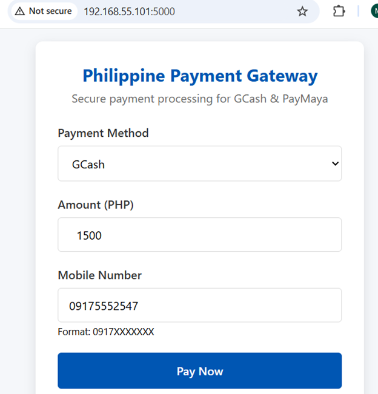
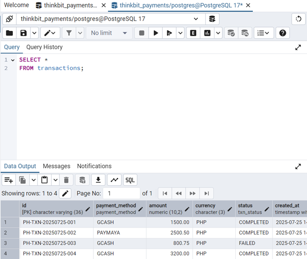
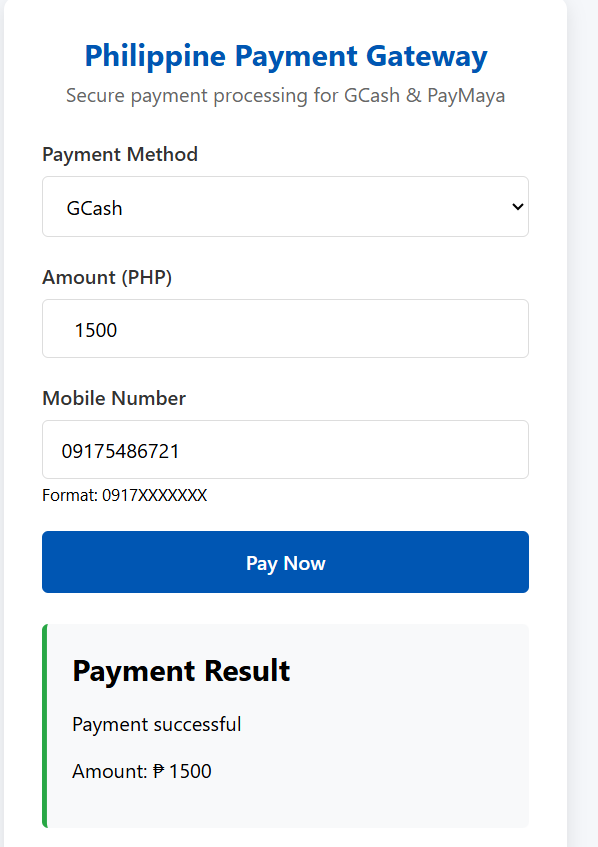
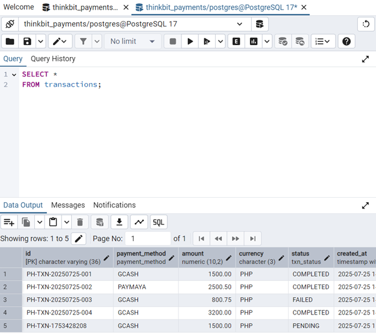

### **ThinkBIT Payments QA Suite - README.md**

```markdown
# ThinkBIT Payments QA Suite



A comprehensive quality assurance solution for Philippine payment systems, featuring automated testing for GCash and PayMaya transactions with PostgreSQL backend.

## 📋 Project Overview
This project provides:
- Mock payment application with Philippine-specific workflows
- Automated UI testing with Selenium
- PostgreSQL database validation
- CI/CD integration via GitHub Actions
- Philippine business rule enforcement (AML checks, PHP currency, mobile validation)

## ⚙️ Tech Stack
- **Frontend**: HTML/CSS (Philippine payment UI)
- **Backend**: Python Flask
- **Database**: PostgreSQL
- **Testing**: Pytest, Selenium
- **CI/CD**: GitHub Actions
- **Environment**: Python Virtual Environment

## 🚀 Getting Started

### Prerequisites
- Python 3.9+
- PostgreSQL 17+
- pgAdmin4
- Google Chrome (for UI tests)

### Setup Instructions

1. **Clone repository**:
   ```bash
   git clone https://github.com/bubblybit23/thinkbit-qa-hackathon.git
   cd thinkbit-payments
   ```

2. **Create and activate virtual environment**:
   ```bash
   # Windows
   python -m venv venv
   .\venv\Scripts\activate

   # macOS/Linux
   python3 -m venv venv
   source venv/bin/activate
   ```

3. **Install dependencies**:
   ```bash
   pip install -r requirements.txt
   ```

4. **Configure environment**:
   ```bash
   cp .env.example .env
   # Edit .env with your PostgreSQL credentials
   ```

5. **Initialize database**:
   - Open pgAdmin4
   - Create `thinkbit_payments` database
   - Execute `db_setup.sql` in the database

## ▶️ Running the Application
```bash
python run.py
```
Access the Philippine payment gateway at: http://localhost:5000


## 🧪 Running Tests
Execute all tests (UI, API, Database):
```bash
pytest --html=report.html
```

Specific test suites:
```bash
# Database tests only
pytest tests/test_db_validation.py

```

## 🔄 CI/CD Pipeline
The GitHub Actions workflow:
1. Creates PostgreSQL container with Philippine timezone
2. Initializes database schema
3. Runs full test suite
4. Generates HTML test report


## 📁 Project Structure
```
thinkbit-payments/
├── app/                      # Mock payment application
│   ├── templates/            # PH payment UI
│   │   └── payment.html      # Payment form
│   ├── __init__.py           # App initialization
│   └── routes.py             # Payment endpoints
├── tests/                    # Test scripts
│   ├── test_ui_payment.py    # UI tests
│   ├── test_api_payment.py   # API tests
│   └── test_db_validation.py # PostgreSQL tests
├── venv/                     # Virtual environment
├── .github/workflows/        # CI/CD pipelines
├── .env.example              # Configuration template
├── .gitignore                # Ignored files
├── requirements.txt          # Python dependencies
├── db_setup.sql              # PostgreSQL schema
├── run.py                    # Application launcher
└── README.md                 # This file
```

## 🇵🇭 Philippine Business Rules
1. **Currency**: All transactions use PHP (₱)
2. **Mobile Validation**: 0917XXXXXXX format
3. **Payment Methods**: GCash (primary), PayMaya (secondary)
4. **AML Compliance**: Transactions > ₱10,000 blocked
5. **GCash Success Rate**: >50% required
6. **Timezone**: All timestamps in Asia/Manila

## 🔍 Sample Test Output







```text
============================ short test summary info ============================
FAILED tests/test_db_validation.py::test_gcash_success_rate - assert (2 / 4) > 0.5
==================== 1 failed, 2 passed in 0.63s =====================
```

## 🛠️ Debugging in VS Code
1. Set breakpoints in test files
2. Use launch configuration:
   ```json
   {
     "name": "Debug PH Tests",
     "type": "python",
     "request": "launch",
     "program": "${file}",
     "env": {"TZ": "Asia/Manila"}
   }
   ```
3. Press F5 to debug

## 📜 License
This project is licensed under the MIT License - see the [LICENSE](LICENSE) file for details.

---
**QA Solutions** • Quality Assurance Project • Philippines
```

## Key Features Highlighted
1. **Philippine Context**:
   - GCash/PayMaya payment methods
   - PHP currency validation
   - Philippine mobile number format
   - Manila timezone support

2. **Virtual Environment Setup**:
   - Clear activation commands for Windows
   - Dependency isolation
   - VS Code integration

3. **Database Initialization**:
   - pgAdmin4 instructions
   - Sample Philippine transaction data

4. **Testing Framework**:
   - Single command execution
   - HTML reports
   - CI/CD integration

5. **Business Rule Enforcement**:
   - AML compliance checks
   - Currency validation
   - Success rate monitoring

The README provides comprehensive setup instructions while highlighting the Philippine-specific aspects of the project. The virtual environment setup is clearly documented, and all security considerations (.env usage) are properly addressed.